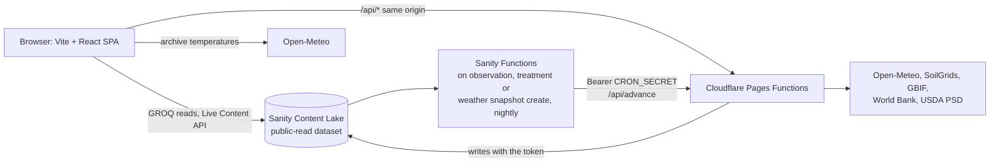

# Mecropolis

Field and crop tracker for Western Cape farms. Each season's crop stage comes from recorded weather: growing degree days (GDD) summed from Open-Meteo temperatures since planting. Regional yield statistics are listed separately with their source.

Live: https://mecropolis.pages.dev

## Try it

- `/` shows the regional weather map, live conditions, soil, pest and yield panels for the Swartland demo site. No sign-in needed.
- `/login` signs in with the demo account and opens `/dashboard`: farms, fields, the season board, compare, CSV export, the activity feed and the recommendation queue (approve, reject, complete).
- `/seasons/:id` shows one season: stage stepper, GDD chart, what-if scenario, field photo, a form to propose a recommendation with the season's evidence, the field's soil test PDF, dated notes (add, edit, delete) with revision history and per-note restore, and the field log (observations, treatments).

Anyone can read the dataset, so the sign-in only controls what the app shows. Every write goes through a Pages Function that checks the session.

## Architecture



- The SPA reads Sanity anonymously through the API CDN and keeps views current with the Live Content API (`useLive`): each query returns sync tags, and a live event naming one of them reruns the loader with `lastLiveEventId`.
- Pages Functions hold every secret (Sanity write token, session key, USDA key) and do all writes.
- The reconciler (`POST|GET /api/advance`) walks each season through `planning, planted, growing, pre-harvest, harvested, review` when its GDD total crosses the crop's threshold. Sanity Functions ([sanity-functions/](sanity-functions/)) trigger it: a document function on each new observation, treatment or weather snapshot, and a scheduled function at 02:00 UTC that walks every season.

## Sanity features used

| Feature                                                              | Where                                                                                                                                                                  |
| -------------------------------------------------------------------- | ---------------------------------------------------------------------------------------------------------------------------------------------------------------------- |
| Custom document schemas, references, nested objects                  | [sanity/schemaTypes/](sanity/schemaTypes/)                                                                                                                             |
| TypeGen                                                              | [sanity/types.ts](sanity/types.ts)                                                                                                                                     |
| GROQ with joins, `references()`, `math::sum`                         | [src/lib/sanity/queries.ts](src/lib/sanity/queries.ts)                                                                                                                 |
| API CDN reads from the browser                                       | [src/lib/sanity/client.ts](src/lib/sanity/client.ts)                                                                                                                   |
| Live Content API (sync tags, `lastLiveEventId`)                      | [src/lib/sanity/useLive.ts](src/lib/sanity/useLive.ts)                                                                                                                 |
| Transactions, `createIfNotExists`, `ifRevisionId` locking            | [functions/\_lib/reconcile.ts](functions/_lib/reconcile.ts), [functions/api/pests.ts](functions/api/pests.ts), [functions/api/notes.ts](functions/api/notes.ts)        |
| Actions API drafts: proposed recommendations, publish on review      | [functions/api/recommendations/](functions/api/recommendations/)                                                                                                       |
| Dataset Embeddings: semantic search over observations and treatments | [functions/api/search.ts](functions/api/search.ts), [src/components/RecordSearch.tsx](src/components/RecordSearch.tsx)                                                 |
| Agent Actions (Prompt): AI summary of a season's stored records      | [functions/api/summary.ts](functions/api/summary.ts), [src/components/SeasonSummary.tsx](src/components/SeasonSummary.tsx)                                             |
| File asset: soil test PDF on a field                                 | [functions/api/assets.ts](functions/api/assets.ts), [src/components/SoilReport.tsx](src/components/SoilReport.tsx)                                                     |
| Assets API upload with LQIP, palette and hotspot                     | [functions/api/assets.ts](functions/api/assets.ts), [src/components/FieldPhoto.tsx](src/components/FieldPhoto.tsx), [src/lib/sanity/image.ts](src/lib/sanity/image.ts) |
| Portable Text                                                        | [functions/api/notes.ts](functions/api/notes.ts), [src/components/SeasonNotes.tsx](src/components/SeasonNotes.tsx)                                                     |
| History API (revision timeline, notes restore)                       | [functions/api/history.ts](functions/api/history.ts), [functions/api/notes/restore.ts](functions/api/notes/restore.ts)                                                 |
| Sanity Functions and Blueprints: document and scheduled functions    | [sanity-functions/sanity.blueprint.ts](sanity-functions/sanity.blueprint.ts)                                                                                           |

## Data rules

- All data is real. Weather and soil come from live APIs; the operator enters observations, treatments and yields.
- Regional benchmarks live in their own `benchmark` documents and are shown on their own.
- Crop model parameters ([src/lib/agronomy/cropModel.ts](src/lib/agronomy/cropModel.ts)) are hand-written estimates with no cited source or validation.

## Run locally

Sanity reads work out of the box against the public dataset:

```bash
npm install
cp .env.example .env.local
npm run dev
```

`npm run dev` serves the SPA on http://localhost:5173 with the map and dataset reads. The landing conditions panels, sign-in and writes run in the Functions; for those you need your own Sanity project: set its project ID, dataset and an Editor token in `.env.local`, fill the other secrets (see [references/environment.md](references/environment.md)), run `npm run seed`, then start the Functions with `npm run dev:api` (http://localhost:8788; the SPA proxies `/api` to it).

## Commands

| Command                                      | Purpose                                                   |
| -------------------------------------------- | --------------------------------------------------------- |
| `npm run dev / build / preview`              | Vite dev server, build to `dist/`, serve the build        |
| `npm run dev:api`                            | Pages Functions locally (wrangler, reads `.env.local`)    |
| `npm run deploy`                             | Build and deploy to Cloudflare Pages                      |
| `npm run typecheck / lint / format:check`    | Static checks                                             |
| `npm test`                                   | Vitest unit tests (no network)                            |
| `npm run seed`                               | Write the demo configuration to the configured dataset    |
| `npm run typegen`                            | Regenerate Sanity types (see `references/environment.md`) |
| `node scripts/extract-harveststat.mjs [csv]` | Rebuild `src/lib/data/harveststat-za.json`                |

CI ([.github/workflows/ci.yml](.github/workflows/ci.yml)) runs typecheck, lint, tests, build and `npm audit` on every push and pull request.

## Layout

```
functions/api/      Pages Functions (session, field log, photos, soil reports, notes, history, reconciler, scenario, weather, pests)
src/pages/          routes (React Router, declared in src/main.tsx)
src/lib/agronomy/   GDD maths and crop model parameters (pure)
src/lib/workflow/   state machine, guards, reconciler (pure) and effects
src/lib/weather/    Open-Meteo client, summaries, pest risk
src/lib/data/       SoilGrids, GBIF, World Bank, USDA PSD, HarvestStat
sanity/schemaTypes/ document schemas
sanity-functions/   Sanity Blueprint (org-scoped stack): functions that call /api/advance
planning/  api/  references/   technical documentation
```

## Documentation

Start at [planning/index.md](planning/index.md). Endpoint contracts are in [api/endpoints.md](api/endpoints.md), external services in [references/external-services.md](references/external-services.md), design decisions in [planning/decisions.md](planning/decisions.md).

## Security

- Reads are anonymous against the public dataset. Writes go through Pages Functions that check the signed session cookie, the `Origin` and the body (Zod); the Sanity write token exists only as a Functions secret.
- Public writes have global hourly caps counted in Sanity, because the demo login is public.
- A Content-Security-Policy in [public/\_headers](public/_headers) allows only the hosts the app uses. The only inline script it allows is the theme script, by its hash.
- `npm audit` is kept at 0.
- Dataset Embeddings quota: the app's search is signed-in only and capped at 15 queries a day across all users, which keeps it under the org's 500 a month. The dataset itself is public, so anyone can send `text::semanticSimilarity` queries straight to Sanity and use up that quota. After judging, embeddings will be turned off or the dataset made private.

## Built with Claude Code

Mecropolis was built with [Claude Code](https://claude.com/claude-code). Every commit is co-authored by Claude.

## License

[MIT](LICENSE)
