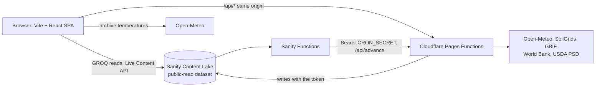

# Technical documentation

Mecropolis is a field and crop tracker built as a Vite and React single-page app on Cloudflare Pages, with Cloudflare Pages Functions for every write and Sanity as the database. This page explains how the parts fit together and how each one works. The farmer-facing guide is in [user-guide.md](user-guide.md), and the in-app version is at `/guide`.

Deeper detail lives in these files, so this page links to them rather than copying them:

- [planning/architecture.md](../planning/architecture.md) has the components, the season advance flow, benchmarks, pests and recommendations.
- [api/endpoints.md](../api/endpoints.md) has every endpoint with its auth, limits and responses.
- [references/environment.md](../references/environment.md) has the environment variables, and [references/external-services.md](../references/external-services.md) has the outside data sources.
- [planning/decisions.md](../planning/decisions.md) records why things were built the way they are.

## How the pieces fit



The browser reads Sanity directly and anonymously, because the dataset is public-read. It never holds a secret. Everything that writes, or that needs a key like the USDA FAS key, runs in a Pages Function under `functions/`. Sanity Functions in `sanity-functions/` call back into the Pages Functions so a season moves forward on its own when new records arrive and once every night.

## The browser app

Routes are declared in `src/main.tsx` with React Router, and pages live in `src/pages`. Public pages (`/`, `/guide`, `/about`, `/docs`, `/login`) use `MarketingLayout`, and the signed-in pages (`/dashboard`, `/dashboard/:farm`, `/seasons/:id`) use `AppLayout`. The sign-in check in `AppLayout` only decides what the app shows, since anyone can read the dataset. The real protection is on the write side.

Reads go through `useLive(loader, params)` in `src/lib/sanity/useLive.ts`. Each loader in `src/lib/sanity/queries.ts` runs its GROQ queries and returns the sync tags Sanity sends back. The hook listens to the Live Content API, and when an event names one of those tags it runs the loader again with `lastLiveEventId`, so the page updates without a reload.

## Growing degree days and stages

A season's stage comes from the weather. `src/lib/agronomy/gdd.ts` adds up growing degree days from the planting date: each day it takes the mean of the daily maximum and minimum temperature, with both capped at the crop's cap temperature, and subtracts the crop's base temperature. Days below the base add zero. Temperatures come from the Open-Meteo archive. The crop parameters in `src/lib/agronomy/cropModel.ts` are hand-written estimates with no cited source, so the app never presents them as validated.

The state machine in `src/lib/workflow` moves a season through `planning`, `planted`, `growing`, `pre-harvest`, `harvested` and `review`. The stage after pre-harvest shows as thermal maturity in the UI because no harvest event is recorded. Each step has a guard that names the number and the threshold it checked, and every stage change stores that evidence. The reconciler at `POST|GET /api/advance` fetches the weather, plans the steps and writes them in one Sanity transaction with `ifRevisionId`, so two runs at once cannot overwrite each other. The full flow is in [planning/architecture.md](../planning/architecture.md#season-advance-flow).

The reconciler runs when someone presses Reconcile now on a season, when a Sanity Function sees a new observation, treatment or weather snapshot, and every night at 02:00 UTC.

## Pages Functions

Every write goes through a Function under `functions/api`. Signed-in handlers use `guard` in `functions/_lib/http.ts`, which checks the signed session cookie (HttpOnly, Secure, SameSite=Strict), the `Origin` header and a rate limit, and each handler validates its body with Zod. `writeClient(env)` in `functions/_lib/sanity.ts` is the only place the write token is used. Because the demo login is published, the public writes also have a global hourly cap counted in Sanity. The list of endpoints is in [api/endpoints.md](../api/endpoints.md).

Two Functions serve reads that need a secret, `/api/landing` for the home page and `/api/conditions` for a farm's weather, soil and pests. Their loaders are wrapped in a 30 minute cache per isolate, and a failure is shown in the UI with its reason instead of being cached.

## Sanity features

The schemas are in `sanity/schemaTypes`, and the README has a table of every Sanity feature the app uses with links to the code. In short, the app uses GROQ with joins, the Live Content API, transactions with revision locks, Actions API drafts for proposed recommendations, Dataset Embeddings for search by meaning, Agent Actions for the season summary, the Assets API for field photos and soil test PDFs, Portable Text notes, the History API for revisions and note restore, and Sanity Functions with Blueprints.

## Languages

The app has a language picker in the header of every page. It offers every language that has a translation file, which is the 120 or so languages listed in `src/lib/i18n/languages.ts`.

- All UI text is in the English catalog, split by area under `src/lib/i18n/catalog/` and merged in `src/lib/i18n/en.ts`.
- Components call `const { t } = useI18n()` from `src/lib/i18n/store.ts` and render `t("key", { name })`. The hook re-renders the component when the language changes. Plain functions can import `t` directly.
- `src/lib/i18n/loader.ts` loads `src/lib/i18n/locales/<code>.json` on demand, so each language is its own small file that only downloads when someone picks it. It sets `lang` and `dir` on the page, so right-to-left languages like Arabic flip the layout. The choice is saved in the browser.
- Things people type, like farm names, notes and observations, and messages sent back by the Functions, stay as they were written.
- Dates use the chosen language through `dateLocale()`.

The translation files are written once by `scripts/translate.ts`, which sends the English catalog to Sanity Agent Actions in chunks with an instruction to write plain, natural farmer language and not word-for-word translation. The script checks every reply has the same keys and the same `{placeholders}` as the English, asks again once for any that fail and stops if they still fail. Nothing calls an AI model while someone uses the site, so there is no running cost and the public demo cannot use up the quota.

To add or change text:

```bash
npm run translate -- --missing
```

That fills in keys a language is missing. When you change the English of an existing key, pass it with `--keys` so every language is redone:

```bash
npm run translate -- --missing --keys guide.what.p1
```

`src/lib/i18n/catalog.test.ts` fails if a locale file is missing a key, has a key the English does not have, or changes a placeholder.

## Tests and checks

`npm test` runs the Vitest unit tests with no network. The pure parts (GDD, the state machine, guards, the reconciler plan, recommendations, notes) have the most tests, and the Functions are tested with the fake context in `functions/_test/context.ts`. `npm run typecheck`, `npm run lint` and `npm run format:check` cover the rest, and CI runs all of them plus the build and `npm audit` on every push.

## Deploy

`npm run deploy` builds the app and deploys `dist` and `functions` to Cloudflare Pages. Secrets are set as Pages secrets. The Sanity Functions are deployed separately from `sanity-functions/` with `../node_modules/.bin/sanity blueprints deploy`.
